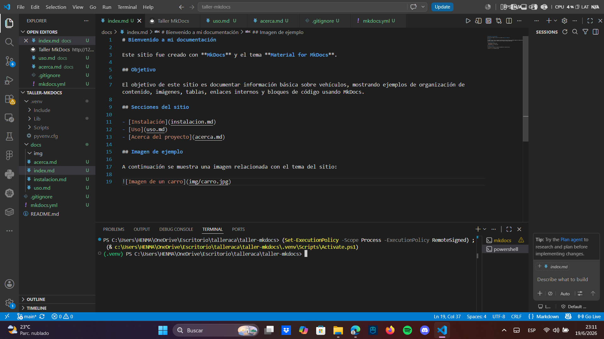

# Bienvenido a mi documentación

Este sitio fue creado con **MkDocs** y el tema **Material for MkDocs**.

## Objetivo

El objetivo de este sitio es documentar información básica sobre vehículos, mostrando ejemplos de organización de contenido, imágenes, tablas, enlaces internos y bloques de código usando MkDocs.

## Secciones del sitio

- [Instalación](instalacion.md)
- [Uso](uso.md)
- [Acerca del proyecto](acerca.md)

## Imagen de ejemplo

A continuación se muestra una imagen relacionada con el tema del sitio:

